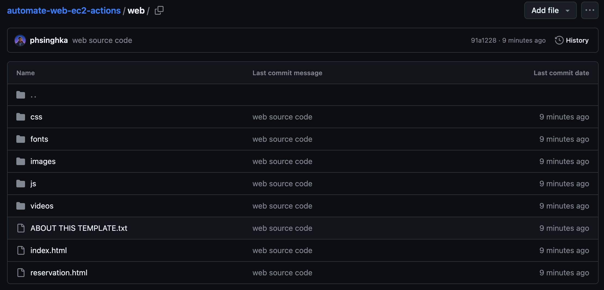

# Static Website Deployment to AWS EC2 Using GitHub Actions

This project demonstrates how to automate the deployment of a **static website** to an AWS EC2 instance using **GitHub Actions**. Each push to the `main` branch triggers an automatic deployment, ensuring that the website stays up to date on the EC2 instance.

## Project Overview

The GitHub Actions workflow does the following:
- On every push to the `main` branch, it triggers a deployment.
- The static website is deployed to an AWS EC2 instance running Nginx.
- It uses `rsync` to sync files from the GitHub repository to the EC2 instance.
- After the files are copied, Nginx is reloaded to serve the updated website.

### Screenshots

#### 1. GitHub Repository Secrets Setup
This shows the SSH private key configuration used for secure deployment.

#### 2. GitHub Repository Setup
This shows the initial GitHub repository setup with the static website files.

#### 3. GitHub Actions Workflow Execution
This shows the GitHub Actions workflow successfully executing the deployment steps.

#### 4. Nginx Running on EC2 Instance
Nginx installed and running on the EC2 instance, ready to serve the static website.

#### 5. Website Running on EC2
This shows the static website running live on the EC2 instance, accessible via its public IP.

- **Trigger**: The workflow triggers on every push to the `main` branch.
- **Rsync**: It uses `rsync` to copy files to the EC2 instance.
- **Nginx Reload**: After syncing the files, Nginx is reloaded to serve the updated content.

## How to Use

1. **Clone the Repository**: Clone this repository to your local machine.
2. **Set Up Secrets**: In your GitHub repository, set up a secret called `SSH_PRIVATE_KEY` with the contents of your EC2 instance's private key.
3. **Modify Workflow**: Update the GitHub Actions workflow (`deploy.yml`) with your EC2 instance details (IP address and paths).
4. **Push Changes**: Push your changes to the `main` branch to trigger an automatic deployment.
